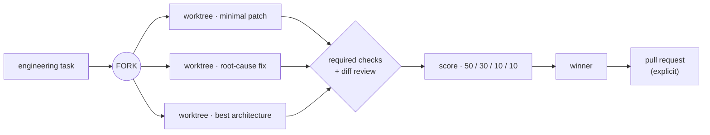
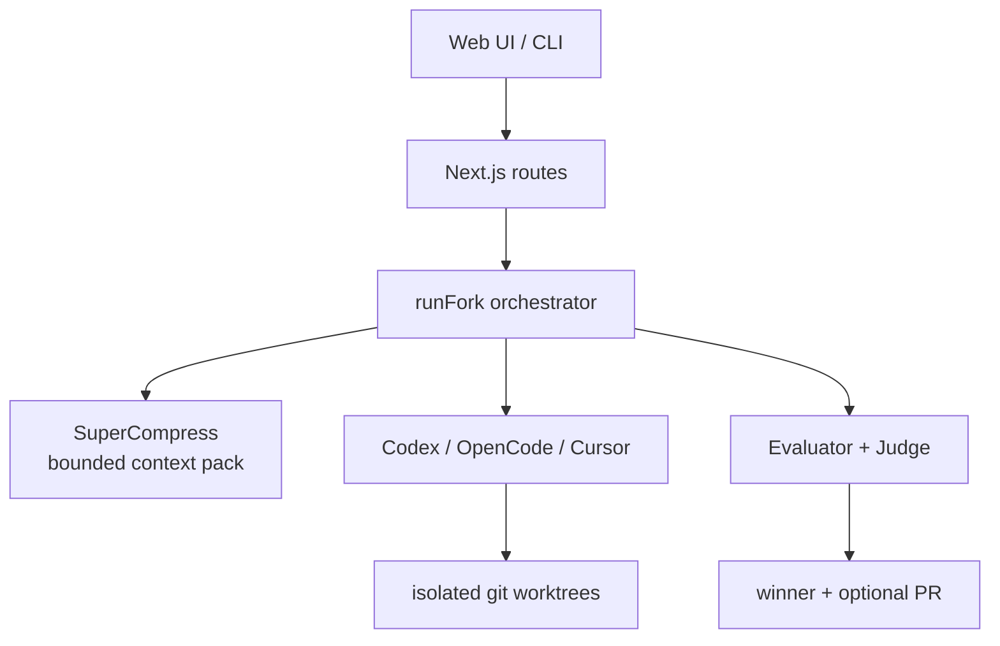

<p align="center">
  <picture>
    <source media="(prefers-color-scheme: dark)" srcset="https://img.shields.io/badge/FORK-SPECULATIVE%20EXECUTION-ECE9E2?labelColor=090a0c">
    
  </picture>
</p>

<p align="center">
  <strong>Run multiple implementations. Test every branch. Ship the best one.</strong>
</p>

<p align="center">
  <a href="#the-idea"></a>
  <a href="#quickstart"></a>
  
  
  
</p>

---

FORK runs the **same engineering task three ways** — minimal patch, root-cause fix,
and architecture-first — inside isolated git worktrees. Each candidate executes the
repository's checks, gets its diff reviewed, and is scored against one deterministic
rubric. One winner comes out; nothing else touches your checkout.



## The idea

The first answer is no longer the default. FORK does not reward the agent that
finishes first — every candidate crosses the same verification boundary before a
winner is chosen. Speculative execution turns "pick an approach and hope" into
"prove three approaches and keep the evidence."

| Weight | Signal | What it rewards |
| ------ | ------ | --------------- |
| **50** | Tests | Required checks pass. This is a gate, not a vanity score. |
| **30** | Review | Diff quality and surfaced findings. |
| **10** | Simplicity | The smallest correct change. |
| **10** | Speed | Completion time — last, never first. |

A small, fast diff does not outrank a correct diff when required checks fail.
Losing branches remain local run artifacts; only the selected branch can become a PR.

## The product

The product is split into focused surfaces — layout, dividers, and whitespace
before cards or shadows:

- **`/`** — the speculative-execution story, rendered as a shader-driven,
  ordered-dither signal field: three procedural filaments converge on one decision.
- **`/sign-up` · `/sign-in`** — local account and signed session.
- **`/dashboard`** — compose runs, watch active work, see real run history.
- **`/dashboard/runs/:id`** — the three candidates stream in and progressively
  reveal checks, review findings, files, diffs, logs, and the final decision.

The visual system is deliberate: a near-black canvas, a single steel accent, warm
graphite surfaces, and one ivory primary action per view. Dither texture is an
**execution signal** — it appears while work is active and stops when motion is
reduced. Geist Sans carries the copy; Geist Mono carries state, commands, scores,
paths, and elapsed time.



## Quickstart

Requirements: Node.js 20+, npm, git, and at least one supported headless agent CLI:
**Codex**, **OpenCode**, or **Cursor Agent**.

```bash
npm install
cp .env.example .env.local
```

Install and authenticate the runtime you want to use:

```bash
codex login                         # Codex
opencode auth login                 # OpenCode
cursor-agent login                  # Cursor
```

For deployed environments, set `AUTH_SECRET` to a random value generated with
`openssl rand -base64 32`. Local development can boot without it and uses a
clearly non-production signing fallback. Accounts are stored under the ignored
`.fork/auth/` directory so the complete sign-up and sign-in flow works without
provisioning an identity vendor for the demo.

Confirm the selected agent is usable before starting a paid or long run:

```bash
codex --version
opencode --version
cursor-agent --version
```

Fork invokes the selected runtime non-interactively inside each generated worktree.
Normal CLI login sessions are preferred; provider API keys remain server-only. The
runtime must be allowed to edit its worktree and execute configured repository commands.

Freebuff is shown in the provider selector for forward compatibility, but its current
CLI is interactive-only and its published terms prohibit scripted/headless operation.
FORK therefore refuses an unattended Freebuff run instead of automating its TUI. When
Freebuff publishes a supported headless interface, it can be enabled in the existing
provider adapter without changing the run contract.

## SuperCompress

SuperCompress is on by default. Before candidates launch, FORK builds a bounded
repository orientation pack and compresses it against the engineering task. The same
compressed context is shared with all three trajectories. During execution, every
provider prompt also tells the agent to use the `compress_context` MCP tool for large
file dumps, logs, diffs, and accumulated tool output.

Use the local compression path with no API key:

```bash
python3 -m pip install supercompress
npm install -g supercompress-proxy
supercompress setup
supercompress mcp-check
```

`supercompress setup` registers MCP for detected Codex, Cursor, OpenCode, and Freebuff
installations. If the local Python package is unavailable, set `SUPERCOMPRESS_API_KEY`
to use the hosted compression API. Compression failures are recorded on the run and
candidates continue without the shared context. The dashboard toggle and CLI
`--no-supercompress` flag disable both the preprocessing instruction and MCP guidance
for a specific run.

## Reproducible CLI demo

The fixture in `examples/demo-repo` is a dependency-free JavaScript project with
a deliberately broken interval merger, a visible test suite, evaluator tests,
and a sample `fork.config.json`. Run the entire demo with:

```bash
npm run demo
```

If the package script is unavailable in an intermediate checkout, the equivalent
command is `npx tsx scripts/demo.ts`. It copies the fixture to a unique directory
under `.fork/demo`, initializes and commits a local git repository, then calls the
core `runFork(request, { onEvent })` orchestrator. The template never contains a
nested `.git` directory, so every run starts from the same clean commit.

The intentionally broken baseline should fail its tests:

```bash
cd examples/demo-repo
npm test
npm run test:hidden
```

Run Fork against another repository with a task string or a JSON config:

```bash
npx tsx scripts/run-fork.ts --repo /absolute/path/to/repo \
  --task "Fix the flaky cache invalidation test without changing the public API" \
  --agent opencode

npx tsx scripts/run-fork.ts --repo /absolute/path/to/repo \
  --config /absolute/path/to/fork.config.json
```

The CLI imports `src/lib/fork/orchestrator.ts` first and the public
`src/lib/fork/index.ts` barrel second. Either must export
`runFork(request, { onEvent? }): Promise<ForkRun>`; if neither does, the command
stops with that exact integration contract instead of silently faking a run.

## Web UI

```bash
npm run dev
```

Open [http://localhost:3000](http://localhost:3000), create a local account, and
enter the workspace. Enter a local Git path or a cloneable repository URL, describe
the task, choose Codex, OpenCode, or Cursor, and start the run. Keep the dev server
alive while candidates execute. Runtime state, generated worktrees, and local account
records live under `.fork/`; they are operational artifacts and should not be committed.

## Checks and scoring

Every command in the run request records its exit code, runtime, and captured output.
Required failed or timed-out checks disqualify a candidate. Candidates that remain
eligible are ranked using test results, review quality, patch simplicity, and
completion speed; the result shows the component scores and the judge rationale.

The demo calls both `npm test` and `npm run test:hidden`. In a real integration,
keep evaluator-only tests outside the candidate's source checkout and expose them
to the command runner through your CI or evaluation harness. The fixture includes
them in-tree solely to make the public demo reproducible.

## Optional Greptile review

Local scoring works without Greptile. To enable the optional review provider,
install and authenticate the `greptile` CLI so `greptile --version` succeeds in
the server environment. If your Greptile setup uses an environment token, set
`GREPTILE_API_KEY` only on the server. Then enable reviews in the request config,
set `FORK_USE_GREPTILE=true`, or pass `--greptile` to the CLI. `--no-greptile`
always wins over config and environment settings. Never expose the key through a
`NEXT_PUBLIC_` variable or commit it to a config file.

## GitHub pull requests

Local demo runs stay local. For a GitHub-backed repository, configure an `origin`
remote and authenticate git/GitHub in the server environment. Evaluation itself
does not publish anything. The explicit **Create PR** action may publish only the
selected candidate branch and create one pull request; losing branches remain
local run artifacts. It does not merge, force-push, or rewrite the base branch. If
authentication or push fails, the evaluated result and winner remain available
and the UI reports PR publication as a separate error.

Use a narrowly scoped token with access only to the target repository. Protected
branches, required reviews, and CI continue to apply normally.

## Security model

Fork executes repository-controlled setup and test commands and gives the selected
coding-agent CLI write access inside generated worktrees. When SuperCompress MCP or
hosted compression is enabled, relevant repository context may be sent to the
SuperCompress service. Treat every target repository as untrusted code: run Fork in
a disposable VM or container for unknown projects, use least-privilege credentials,
do not mount SSH keys or cloud credentials, and review commands before execution.
Keep `.env.local`, `.fork/`, and agent logs out of version control because they can
contain secrets or sensitive source output.

The orchestrator should enforce command and agent timeouts, bounded output capture,
isolated worktrees, and explicit allowed repository locations. Fork is not a
security sandbox by itself.

## Brand

The identity lives in `design.md` and the assets in `public/brand/`.

| Token | Value | Role |
| ----- | ----- | ---- |
| Canvas | `#090a0c` | near-black ground |
| Graphite | `#0c0e10` | calm product surface |
| Steel | `#aeb9c2` | the single desaturated accent |
| Ivory | `#e8e4dc` | the one primary action |
| Muted | `#989da1` | secondary copy |

- **Geist Sans** — interface copy.
- **Geist Mono** — state, commands, scores, paths, elapsed time.
- **Ordered Bayer dither** — the execution signal, crisp, never gradient or glow.

## Launch video

A 30s beat-synced launch cut lives in `videos/fork-launch/` — authored with
[HyperFrames](https://github.com/heygen-com/hyperframes), cut to a 123 BPM
track, and rendered straight from the brand's own DitherKit engine (ordered
Bayer washes, canvas-painted dithered score bars, additive bloom).


The cut: **FORK mark** → three colored implementations run in parallel → they
**converge into one winner** → the **50/30/10/10 evidence** counts up as
dithered bars → **ship the best one** → lockup.

Re-render locally:

```bash
cd videos/fork-launch
npm run render                 # standard
npm run render -- --quality high
```

## License

[MIT](./LICENSE)
